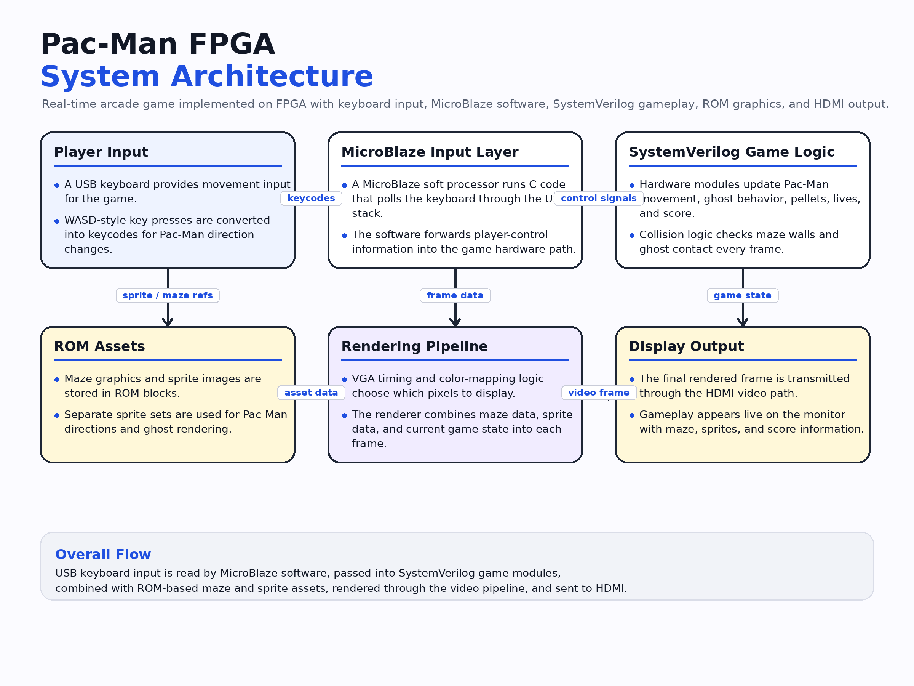
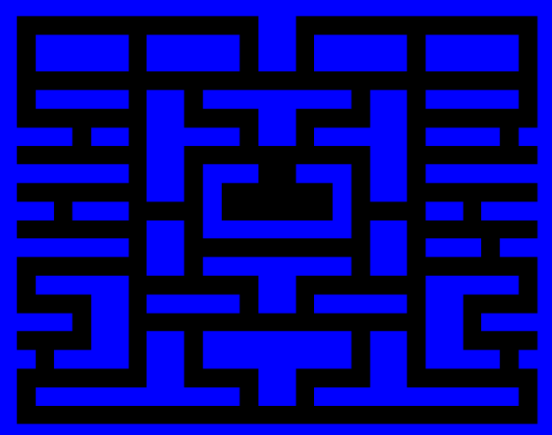
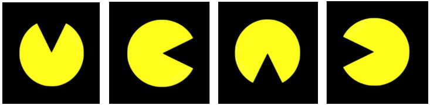
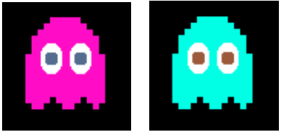
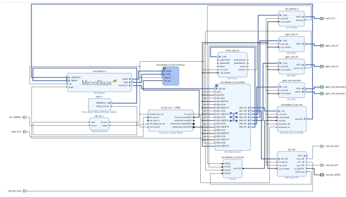

# Pac-Man FPGA

A real-time Pac-Man game implemented on FPGA, combining SystemVerilog game logic, ROM-based graphics, a MicroBlaze soft processor, USB keyboard input, and HDMI video output.

## Overview

This project recreates a playable Pac-Man-style arcade experience on FPGA. The design integrates keyboard input, sprite-based rendering, maze navigation, pellet collection, ghost behavior, collision detection, score tracking, and video output to an HDMI display.

The system combines hardware modules for graphics and gameplay with a MicroBlaze-based software layer that handles USB keyboard input.

## My Role

I contributed across the FPGA system integration and game implementation workflow, including working with SystemVerilog game modules, top-level hardware integration, sprite/maze graphics flow, and the MicroBlaze-based I/O pipeline used for player input.

## Project Gallery

### System Architecture

<p align="center">
  
</p>

The game flow starts with USB keyboard input, which is read by MicroBlaze software and passed into the SystemVerilog game-logic modules. These modules update Pac-Man movement, ghost behavior, pellets, collisions, and score state. The graphics pipeline then uses ROM-based maze and sprite assets to render each frame for HDMI output.

### Maze and Sprite Assets

<p align="center">
  
  &nbsp;&nbsp;
  
</p>

The visual system uses ROM-backed assets for the maze layout and directional Pac-Man sprite states.

### Ghost Sprites

<p align="center">
  
</p>

Separate ghost sprite assets are used for enemy rendering and movement feedback in the game view.

### MicroBlaze Hardware System

<p align="center">
  
</p>

The hardware platform integrates a MicroBlaze processor subsystem with AXI peripherals for USB, GPIO, timers, SPI, and supporting I/O needed for the game system.

## Tech Stack

| Area | Tools |
| --- | --- |
| FPGA / Hardware | SystemVerilog, Vivado, Xilinx IP |
| Embedded Software | C, MicroBlaze SDK |
| Graphics | ROM-based sprite assets, color mapping, VGA/HDMI pipeline |
| Input | USB keyboard via MicroBlaze USB stack |
| Game Systems | Movement logic, collision detection, scoring, ghost behavior |

## Features

- Real-time Pac-Man gameplay on FPGA
- USB keyboard-controlled movement
- ROM-based maze and sprite rendering
- Directional Pac-Man sprites
- Ghost behavior and enemy collision logic
- Pellet collection and score tracking
- HDMI display output
- Integrated MicroBlaze software/hardware system

## Hardware / Game Logic

The FPGA design is organized around a top-level SystemVerilog integration layer, gameplay modules, and a video pipeline. Key logic areas include:

```txt
mb_usb_hdmi_top.sv      top-level integration
pacman.sv               Pac-Man movement logic
ghost.sv / ghostm.sv    ghost behavior modules
pellet.sv               pellet handling
collision.sv            collision detection
score.sv                score tracking
graphics_controller.sv  rendering coordination
```

The MicroBlaze software reads USB keyboard input and communicates movement/control data into the game hardware flow.

## Repository Structure

```txt
.
├── README.md
├── hardware/
│   ├── top-level/              # top-level SystemVerilog integration
│   ├── game-logic/             # Pac-Man, ghost, pellet, collision, score, graphics modules
│   ├── block-design/           # MicroBlaze block design export
│   ├── constraints/            # FPGA pin constraints
│   └── ip-config/              # selected Xilinx IP configuration files
├── software/
│   └── microblaze-game/
│       └── src/                # MicroBlaze C source and USB stack files
└── docs/
    └── assets/
        ├── maze-layout.png
        ├── pacman-direction-sprites.png
        ├── ghost-sprites.png
        ├── microblaze-block-diagram.png
        └── system-architecture.png
```
